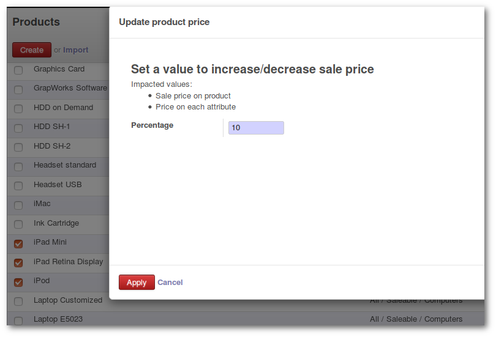

.. image:: https://img.shields.io/badge/licence-AGPL--3-blue.svg
   :target: http://www.gnu.org/licenses/agpl
   :alt: License: AGPL-3

==============================
Product Variants Update Prices
==============================

This module makes it easy to increase / decrease price of variants in a massive way.

Usage
=====

A wizard allows to apply a percentage to selected products

.. figure:: product_variant_update_price/static/description/upd_price.png
   :width: 700 px

.. image:: https://odoo-community.org/website/image/ir.attachment/5784_f2813bd/datas
   :alt: Try me on Runbot
   :target: https://runbot.odoo-community.org/runbot/137/8.0

Known issues / Roadmap
======================

* Don't use in combination with product_variant_sale_price: modules are not compatibles

Bug Tracker
===========

Bugs are tracked on `GitHub Issues
<https://github.com/OCA/{project_repo}/issues>`_. In case of trouble, please
check there if your issue has already been reported. If you spotted it first,
help us smash it by providing detailed and welcomed feedback.

Credits
=======

Images
------

* Icon http://www.freeiconsweb.com/

Contributors
------------

* David Beal <david.beal@akretion.com>

Do not contact contributors directly about support or help with technical issues.

Maintainer
----------

.. image:: https://odoo-community.org/logo.png
   :alt: Odoo Community Association
   :target: https://odoo-community.org

This module is maintained by the OCA.

OCA, or the Odoo Community Association, is a nonprofit organization whose
mission is to support the collaborative development of Odoo features and
promote its widespread use.

To contribute to this module, please visit https://odoo-community.org.
